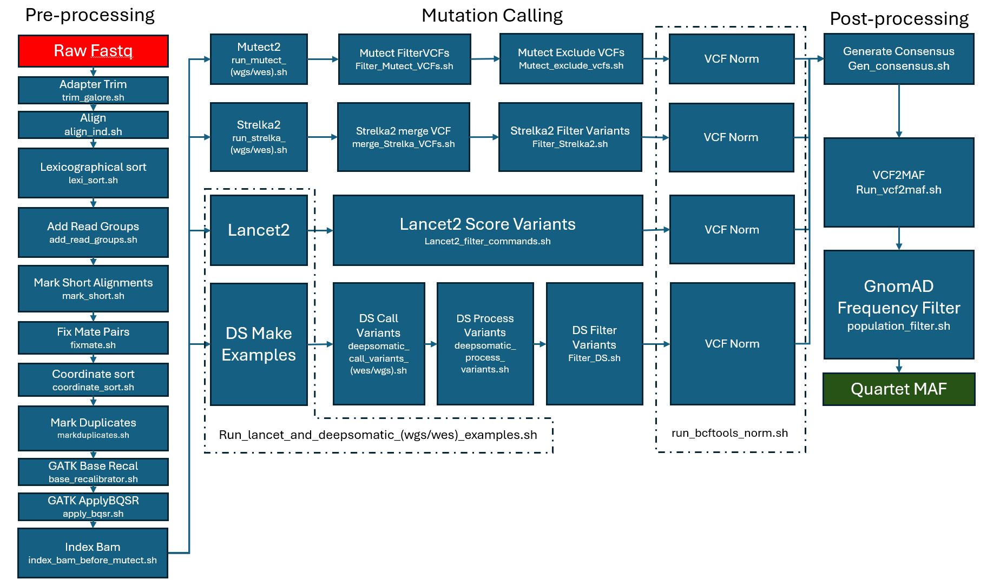

# Quartet
Quartet is a DNA sequencing pipeline intended for short somatic mutation discovery for cell lines sequenced using standardized WES or WGS.

## Overview of the Quartet Pipeline


## Prerequisites
* Slurm 23.02.7
* GNU Parallel 20251122
* Samtools 1.21
* [bwa-mem2](https://github.com/bwa-mem2/bwa-mem2) 2.2.1
* Java JDK 17.0.15
* Genome Analysis Toolkit (GATK) 4.6.0.0
* [Trim Galore](https://github.com/felixkrueger/trimgalore) 0.6.10
* Bedtools 2.30.0
* bcftools 1.22
* Lancet2 2.8.6
* DeepSomatic 1.9.0
* Ensembl VEP 115.2
* [vcf2maf](https://github.com/mskcc/vcf2maf) 1.6.22

## Required input files
* Unprocessed fastq files from sample/s
* List of newline-seperated Sample IDs (acc_file in argmaker files)
* [Reference Genome](https://www.ncbi.nlm.nih.gov/datasets/genome/GCF_000001405.26/)
* [GATK resource bundle](https://gatk.broadinstitute.org/hc/en-us/articles/360035890811-Resource-bundle)
* Interval file if limiting to coding regions, [example file provided](hg38_exome_regions_refseq.bed)
* Contemporary Normal, I use NA12878 sourced from [IGSR](https://www.internationalgenome.org/data-portal/sample/NA12878)

## Example Usage
Each step of the pipeline is localized in 3 files, a base_script which is used to process an individual sample, an argmaker which creates a command to execute for each sample one would like to process, and a launcher which enables batch computing through a combination of slurm and GNU parallel. 
```
sh [SCRIPT]_argmaker.sh [ARGS TO INCLUDE, including base_script, and out_file]
sbatch [SCRIPT]_launcher.sh [out_file]
```
For a couple steps (filter_lancet2_commands.sh and run_strelka_(wgs/wes)).sh a unique conda environment is neccesary, in those cases please activate their respective conda environments before sbatch.


## Cite
Please cite the Quartet paper if using this repo. Citation is forthcoming following manuscript publication.
